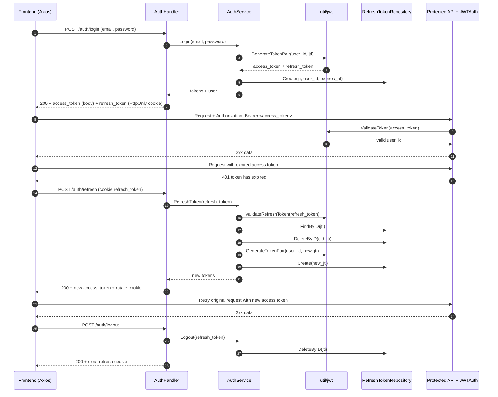
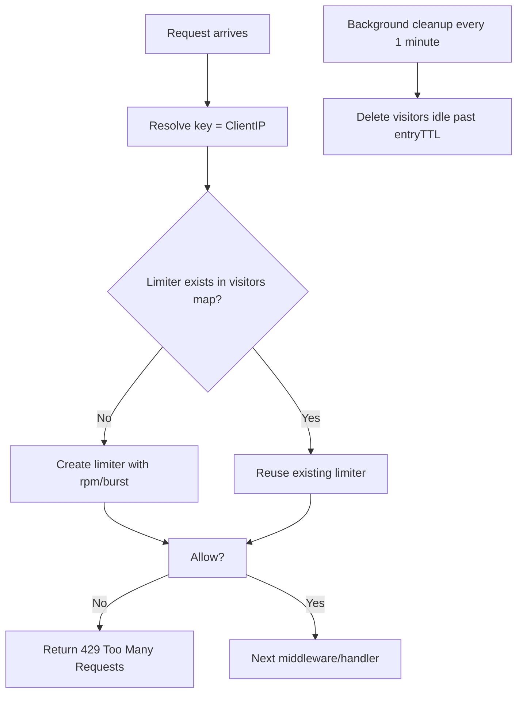
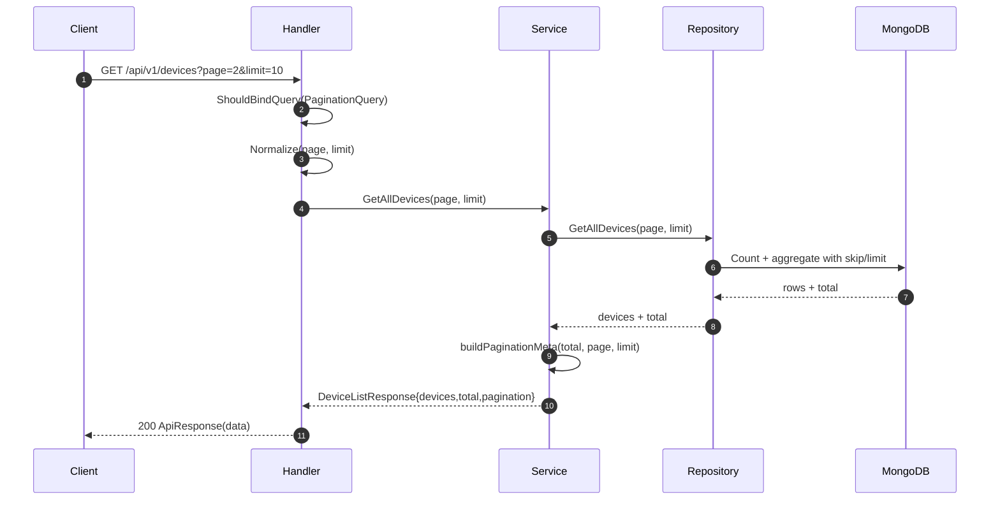
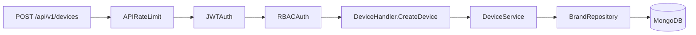

# JWT, Rate Limit, va Phan trang trong TZone

Tai lieu nay mo ta chi tiet co che xac thuc JWT, gioi han tan suat request (rate limit), va phan trang API trong du an TZone.

## 1) Tong quan luong request

Trong backend TZone, mot request thuong di qua cac lop:

1. Route (`internal/delivery/route/*`)
2. Middleware (`internal/delivery/middleware/*`)
3. Handler (`internal/delivery/handler/*`)
4. Service (`internal/service/*`)
5. Repository (`internal/repository/*`)

Cac co che duoi day duoc "cai" vao flow nay:

- JWT: dung de xac thuc (va ket hop RBAC de phan quyen).
- Rate limit: chan bot request qua nhanh theo IP.
- Phan trang: chuan hoa `page`, `limit`, va tra ve metadata.

---

## 2) JWT hoat dong nhu the nao

### 2.1 File lien quan

- Route auth: `internal/delivery/route/auth_route.go`
- Handler auth: `internal/delivery/handler/auth_handler.go`
- Service auth: `internal/service/auth_service.go`
- JWT utils: `util/jwt/jwt.go`
- JWT middleware: `internal/delivery/middleware/jwt_middleware.go`
- Luu refresh token: `internal/repository/refresh_token_repository.go`, `internal/model/refresh_token.go`
- Interceptor frontend: `fe/src/api/client.ts`

### 2.2 Token pair va claim

He thong su dung **token pair**:

- Access token (JWT, song ngan): ~30 phut
- Refresh token (JWT, song dai): ~7 ngay

Trong `util/jwt/jwt.go`:

- `GenerateTokenPair(userID, jti)` tao 2 token ky bang HS256 voi `JWT_SECRET`.
- Access token claims:
  - `user_id`
  - `exp` (now + 30m)
  - `iat`
- Refresh token claims:
  - `user_id`
  - `jti` (session id)
  - `exp` (now + 7d)
  - `iat`

### 2.3 Login flow

1. Client goi `POST /auth/login` (`auth_route.go`).
2. `AuthHandler.Login` bind JSON email/password.
3. `AuthService.Login`:
   - Tim user theo email.
   - So sanh password hash bang bcrypt.
   - Tao `jti` moi, sinh token pair.
   - Luu `jti` vao bang `refresh_tokens` (GORM) de quan ly session.
4. Handler tra:
   - Access token trong JSON body.
   - Refresh token trong cookie `refresh_token` (HttpOnly).

Response thanh cong (rut gon):

```json
{
  "success": true,
  "code": 200,
  "message": "login success",
  "data": {
    "access_token": "<jwt>",
    "user": {
      "id": "<uuid>",
      "email": "user@example.com"
    }
  }
}
```

### 2.4 Truy cap endpoint can dang nhap

Cac route can xac thuc duoc gan middleware `JWTAuth()` (vd create/update/delete brand/device):

- `internal/delivery/route/brand_route.go`
- `internal/delivery/route/device_route.go`
- `internal/delivery/route/frontend_route.go` (nhom `/admin`)

`JWTAuth()` (`jwt_middleware.go`) lam cac buoc:

1. Lay header `Authorization`.
2. Ky vong format: `Bearer <access_token>`.
3. Goi `jwt.ValidateToken(tokenString)`.
4. Neu hop le: set `user_id` vao `gin.Context` roi `Next()`.
5. Neu loi:
   - Khong co token -> `401 authorization token is required in header`
   - Het han -> `401 token has expired`
   - Khong hop le -> `401 invalid token`

### 2.5 Refresh flow (token rotation)

Endpoint: `POST /auth/refresh`

1. Handler doc cookie `refresh_token`.
2. `AuthService.RefreshToken`:
   - Validate chu ky + expiry + parse `user_id`, `jti`.
   - Kiem tra `jti` co ton tai trong DB khong.
   - Neu khong ton tai: nghi ngo token reuse/forged -> xoa tat ca refresh token cua user (`DeleteAllByUserID`), bao loi bao mat.
   - Neu hop le: xoa refresh token cu (`DeleteByID`) va tao cap token moi (rotation).
   - Luu `jti` moi vao DB.
3. Handler set lai cookie `refresh_token` moi va tra access token moi trong body.

Frontend (`fe/src/api/client.ts`) co response interceptor:

- Khi gap `401`, no thu goi `POST /auth/refresh` (co `withCredentials`).
- Neu refresh thanh cong: luu access token moi, retry request cu.
- Neu refresh that bai: clear localStorage va chuyen ve `/login`.

### 2.6 Logout flow

Endpoint: `POST /auth/logout`

- Doc refresh token tu cookie.
- Goi service de xoa `jti` trong DB.
- Xoa cookie refresh token.

### 2.7 Luu y bao mat hien tai

- `JWT_SECRET` neu khong set se roi ve `default_secret_key` trong `util/jwt/jwt.go`.
  - Khuyen nghi: bat buoc set bien moi truong tren moi moi truong production.
- Cookie refresh token dang duoc set `secure=false` (phu hop local HTTP), production nen dung `secure=true` + HTTPS.

---

## 3) Rate limit hoat dong nhu the nao

### 3.1 File lien quan

- Middleware: `internal/delivery/middleware/rate_limit_middleware.go`
- Gan vao route:
  - `AuthRateLimit()` trong `internal/delivery/route/auth_route.go`
  - `APIRateLimit()` trong `internal/delivery/route/brand_route.go`, `internal/delivery/route/device_route.go`

### 3.2 Co che

Middleware su dung `golang.org/x/time/rate` (token bucket):

- Moi IP co 1 `rate.Limiter` rieng trong map `visitors`.
- `Allow()` duoc goi moi request:
  - Con token -> cho qua.
  - Het token -> tra `429 Too Many Requests`.
- Co cleanup background moi 1 phut, xoa visitor khong hoat dong qua `entryTTL`.

### 3.3 Cac profile gioi han

`AuthRateLimit()` (nhom `/auth`):

- Env: `RATE_LIMIT_AUTH_RPM` (default 20)
- Env: `RATE_LIMIT_AUTH_BURST` (default 5)
- TTL visitor: 20 phut

`APIRateLimit()` (nhom `/api/v1/brands`, `/api/v1/devices`):

- Env: `RATE_LIMIT_API_RPM` (default 120)
- Env: `RATE_LIMIT_API_BURST` (default 30)
- TTL visitor: 10 phut

Cong tac bat/tat chung:

- `RATE_LIMIT_ENABLED` (default `true`)

### 3.4 Response khi vuot han muc

Middleware tra JSON truc tiep:

```json
{
  "success": false,
  "message": "Too many requests",
  "error": "api rate limit exceeded"
}
```

Hoac voi auth:

```json
{
  "success": false,
  "message": "Too many requests",
  "error": "auth rate limit exceeded"
}
```

### 3.5 Luu y van hanh

- Rate limiter hien tai la **in-memory per process**:
  - Restart service se reset limiter.
  - Chay nhieu instance can can nhac external/distributed limiter (Redis).
- Identifier mac dinh la `ClientIP()`; can cau hinh proxy dung neu deploy sau load balancer.

---

## 4) Phan trang hoat dong nhu the nao

### 4.1 File lien quan

- DTO query + normalize: `internal/dto/request.go`
- Meta phan trang: `internal/dto/response.go`, `internal/service/brand_service.go` (`buildPaginationMeta`)
- Handler bind query:
  - `internal/delivery/handler/brand_handler.go`
  - `internal/delivery/handler/device_handler.go`
- Repository truy van co `skip/limit`:
  - Brands: `BrandRepository.GetAllBrands`
  - Devices: `BrandRepository.GetAllDevices`
  - Devices theo brand: `BrandRepository.GetDevicesByBrandID`

### 4.2 Chuan hoa tham so page/limit

`PaginationQuery` co 2 truong query:

- `page`
- `limit`

Ham `Normalize()`:

- `page < 1` -> ve `1`
- `limit < 1` -> ve `10`
- `limit > 100` -> cat xuong `100`

### 4.3 Handler layer

Vi du `GetAllBrands` / `GetAllDevices`:

1. `ShouldBindQuery(&pagination)`
2. `pagination.Normalize()`
3. Goi service voi `page`, `limit`
4. Tra response theo `response.Success(...)`

Neu query khong hop le theo kieu du lieu -> tra `400`.

### 4.4 Service layer va metadata

Service nhan `total` tu repository va tao `PaginationMeta`:

- `page`: trang hien tai
- `limit`: kich thuoc trang
- `total`: tong so ban ghi
- `total_pages`: `ceil(total/limit)` (neu `total=0` thi `0`)
- `has_next`: `page*limit < total`
- `has_prev`: `page > 1`

### 4.5 Repository layer

#### Brands

`GetAllBrands`:

- `skip = (page - 1) * limit`
- `Find(...).SetSkip(skip).SetLimit(limit).SetSort({_id:-1})`
- `CountDocuments` de lay tong

#### Devices (embedded trong brand)

Du lieu device dang la mang embedded trong document brand, nen dung aggregate:

- `GetAllDevices`:
  - Count pipeline: `$unwind devices` + `$count`
  - Data pipeline: `$unwind` -> `$project` -> `$sort` -> `$skip` -> `$limit`

- `GetDevicesByBrandID`:
  - Them `$match {_id: brandID}` truoc unwind de loc theo brand
  - Sau do cung ap dung count va data pipeline tuong tu

### 4.6 Mau response phan trang

`GET /api/v1/devices?page=1&limit=10`:

```json
{
  "success": true,
  "code": 200,
  "message": "Devices retrieved successfully",
  "data": {
    "devices": [
      {
        "id": "...",
        "brand_id": "...",
        "model_name": "..."
      }
    ],
    "total": 42,
    "pagination": {
      "page": 1,
      "limit": 10,
      "total": 42,
      "total_pages": 5,
      "has_next": true,
      "has_prev": false
    }
  }
}
```

---

## 5) Ket hop 3 co che trong 1 request thuc te

Vi du request: `POST /api/v1/devices`

1. Route trong `device_route.go` da gan:
   - `APIRateLimit()`
   - `JWTAuth()`
   - `RBACAuth(...)`
2. Request vao:
   - Qua rate limit truoc (chan spam).
   - Qua JWTAuth de xac thuc access token.
   - Qua RBAC de kiem tra quyen.
3. Handler bind body, goi service, repository va tra `ApiResponse`.

Voi request list (`GET /api/v1/devices`, `GET /api/v1/devices/brand/:brandId`, `GET /api/v1/brands`), co them xu ly pagination ngay tu handler.

---

## 6) Checklist debug nhanh

### JWT

- `401 authorization token is required in header`: thieu header `Authorization`.
- `401 token has expired`: access token het han -> goi refresh.
- Refresh fail: kiem tra cookie `refresh_token`, CORS/withCredentials, va DB record cua `jti`.

### Rate limit

- Bi `429` lien tuc:
  - Kiem tra `RATE_LIMIT_ENABLED`.
  - Kiem tra `RATE_LIMIT_*_RPM`, `RATE_LIMIT_*_BURST`.
  - Kiem tra IP bi nhan dien co bi dung chung (proxy/NAT).

### Pagination

- Khong thay du lieu o page cao: co the da qua tong so trang.
- Limit lon hon 100 se bi cat ve 100 theo `Normalize()`.

---

## 7) Tham khao nhanh endpoint lien quan

- Auth:
  - `POST /auth/register`
  - `POST /auth/login`
  - `POST /auth/refresh`
  - `POST /auth/logout`

- Brands:
  - `GET /api/v1/brands?page=&limit=`
  - `POST/PUT/DELETE /api/v1/brands...` (can JWT)

- Devices:
  - `GET /api/v1/devices?page=&limit=`
  - `GET /api/v1/devices/brand/:brandId?page=&limit=`
  - `POST/PUT/DELETE /api/v1/devices...` (can JWT)

---

## 8) Diagrams (Mermaid)

### 8.1 JWT lifecycle (login -> access protected API -> refresh -> logout)



### 8.2 JWTAuth middleware decision flow

```mermaid
flowchart TD
    A[Incoming request] --> B{Authorization header exists?}
    B -- No --> E[Return 401: authorization token is required]
    B -- Yes --> C{Format Bearer <token>?}
    C -- No --> E
    C -- Yes --> D[ValidateToken(token)]
    D --> F{Valid?}
    F -- Expired --> G[Return 401: token has expired]
    F -- Invalid --> H[Return 401: invalid token]
    F -- Valid --> I[Set user_id in gin.Context]
    I --> J[Next middleware/handler]
```

### 8.3 Rate limit flow (token bucket per IP)



### 8.4 Pagination flow (handler -> service -> repository)



### 8.5 Middleware order tren protected endpoint




